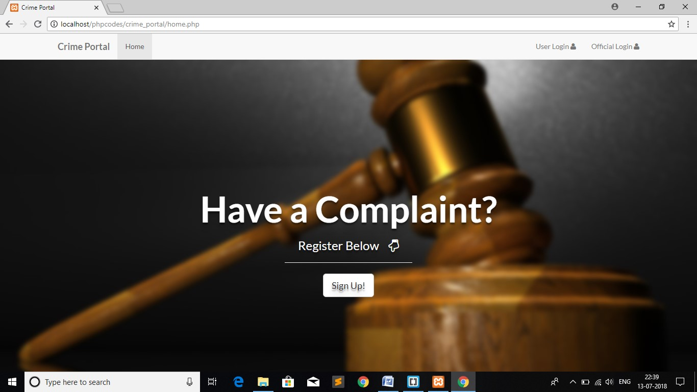
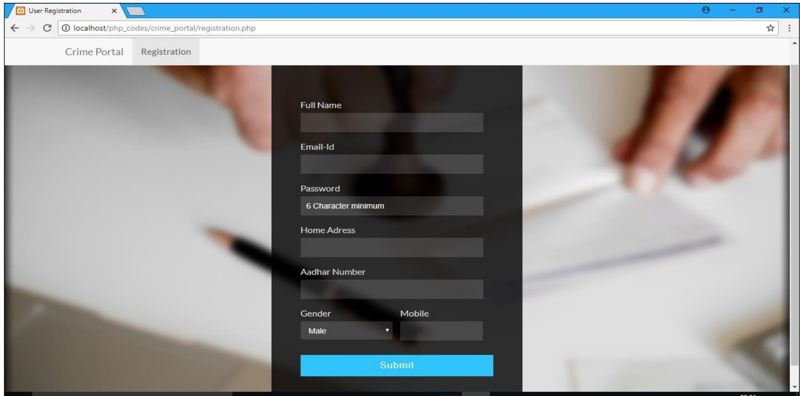
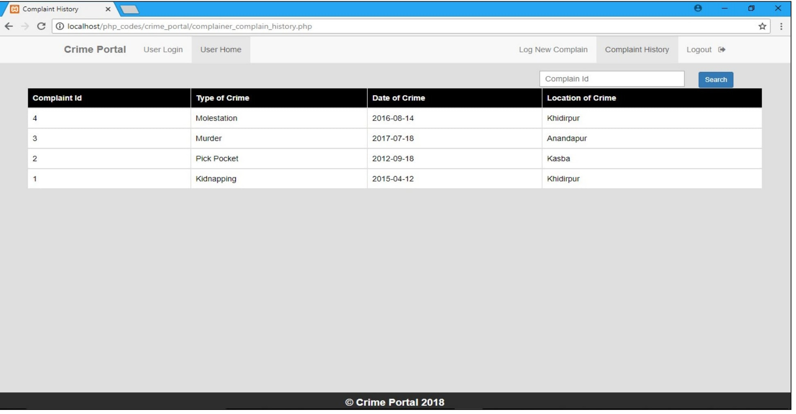
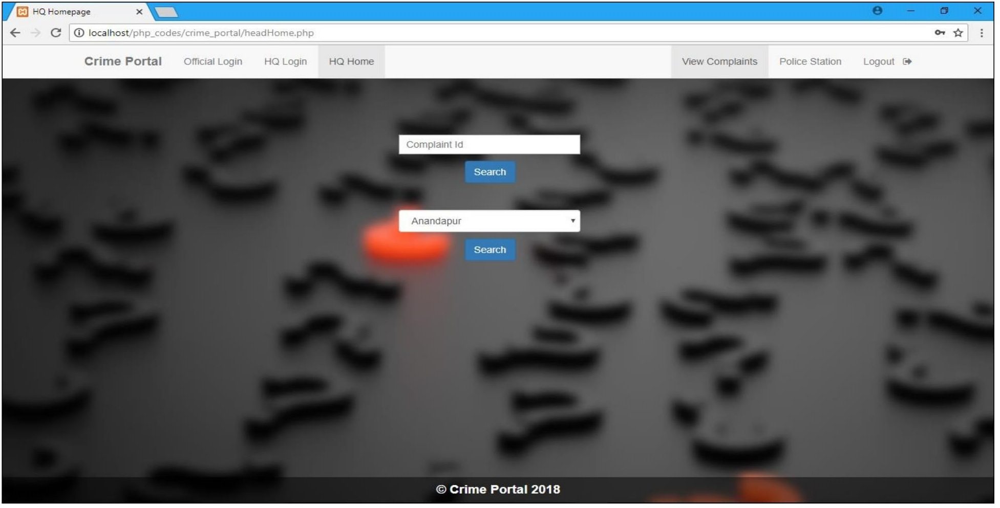

<h1 align="center">Welcome to Online FIR Portal 👋</h1>
<p>
  
  <a href="#" target="_blank">
    
  </a>
  <a href="https://twitter.com/alok722" target="_blank">
    
  </a>
  <a href="https://github.com/alok722" target="_blank">
                                           
  </a>
</p>

> A website where user can log an FIR online. This website has 4 modules: Head-quarter, Police In-charge, Police, User. It is multifunctional website with back end support.

## Project Objective
1. To provide an online platform where user can log a FIR at ease.
2. Complainant can see the regular update of the filed case.
3. Head Quarter can easily monitor the update of individual case.
4. To provide transparency in working system of the case.
5. It will reduce the bribe.

## Project Scope
### Complainant Module

-	Complainant can file an FIR online and can see the regular update of the filed case. 
-	He/She can file multiple FIR.

### HQ Module

-	HQ can monitor every case.
-	HQ can add or delete the police station (By Police Station means, every area would have single Police Station and it's in-charge).
-	HQ will provide login credential to Police In-charge.
- Login credential and path for HQ/Admin:
- Path: Official Login -> HQ Login
- Credential: Username: `admin`, Password: `admin`

### In-charge Module
-	In-charge can see the case allocated to his location.
-	He/She can add police officers for his/her location. 
-	In-charge will assign the case to each police.
-	In-charge will provide login credential to Police.
- Login credential for every Incharge would be provided by HQ.

### Police Module
-	Police can only see the details of that case which has been assigned by the In-charge.
-	Police can update the status of each case.
-	Police can close the case and file the charge-sheet.
- Login Credential for every Police would be provided by respective Incharge.

## [Database Schema](./DB)

### ✨ Screenshots (Few) :
  
  
  
  

## Usage

```sh
Supported on Xampp v5.6.36
```

## Author

👤 **Alok Raj**

* Website: https://opendevs.in
* Twitter: [@alok722](https://twitter.com/alok722)
* Github: [@alok722](https://github.com/alok722)
* LinkedIn: [@alok722](https://linkedin.com/in/alok722)

## 🗒 Future Plans

- OTP verification can be added to authenticate the user.
- Data Sharing between police station can be incorporated.
- Wanted Criminal reward system can be added.
- Chat Support Between Officers can be added.
- Location of crime will be automatically detected just by pointing on the map.

## 🤝 Contributing

Contributions, issues and feature requests are welcome!<br />Feel free to check [issues page](https://github.com/alok722/E-Crime-Management-System/issues). 

## Show your support

Give a ⭐️ if this project helped you!

## 📝 License

Copyright © 2020 [Alok Raj](https://github.com/alok722).

***
_This README was generated with ❤️ by [readme-md-generator](https://github.com/kefranabg/readme-md-generator)_
